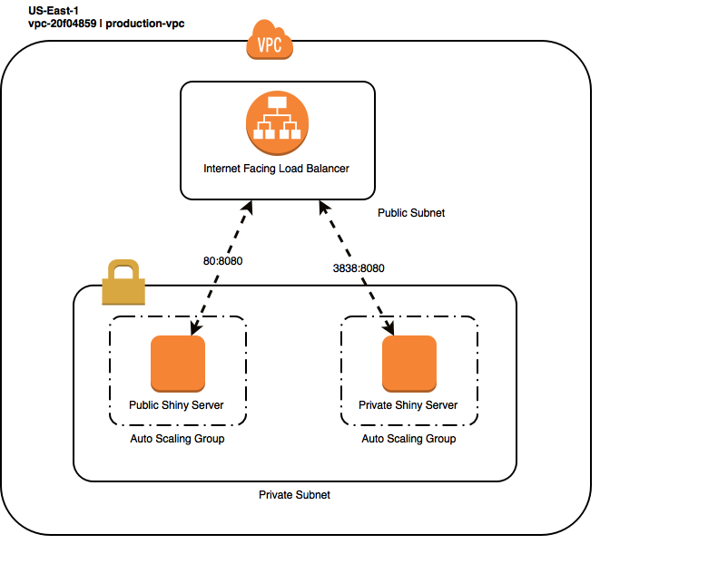

### Shiny Proxy 
This repository contains the deployment procedures for the Open Analytics Shiny Proxy Application. 

Shiny Proxy allows us to deploy shiny applications without using any of the R based technology on the server side. 

 
For a more in-depth introduction on Shiny Proxy check out: 
https://www.shinyproxy.io

## Deployment 
In order to deploy Shiny Proxy, we are using a combination of Terraform and CloudFormation to programmatically 
provision AWS resources based off the source code in the `infrastructure/` folder. 

### terraform 
* The terraform folder defines the AWS resources needed to run the Shiny Proxy application 
* At a high level the deployed infrastructure is represented in the following graph

### codebuild 
* These scripts are run as apart of of the AWS Code Pipeline deployment process
* They install the required software on the build server and then run the terraform deployment code 

## tf-stack
* These folders are used to keep separate environments for production and development. 
* This may not be necessary since I have specified that the state be tracked in a remote s3 bucket, 
but its better to be safe. 

## config 
* this folder contains the configuration files that determine which shiny applications are available on each server
    * `public_application.yml` defines the shiny apps that will be available on the public shiny server 
    * `application.yml` defines the shiny apps that will be available on the private shiny server 
## Continuous Integration
 This repository has been set up to be apart of a continuous integration pipeline defined here:
    [CloudFormation Template](infrastructure/pipeline-shinyproxy.yml)
    
 * This means that any changes committed to the master branch on GitHub will be automatically deployed 
 * Also I have set up another CI pipeline tracking each shiny app repository
    * Committing to the master branch of the shiny app repository will set off a docker build process that will build a new image and upload it to the amazon container repository
    
    
 ## Troubleshooting 
 * ssh into the bastion host with the ssh forwarding agent flag on: `ssh -A -i ~/.ssh/shinyserver.pem ec2-user@34.207.13.110`
     * the ssh key can be found under the `city-of-boston/secrets/` folder 
 * ssh into either the public or private shiny server: `ssh ubuntu@<shiny-server-private-ip>`
     * the private ip's can be found in the aws console 
 * shiny server logs can be viewed: `tail -f shinyproxy/shinyproxy.out` or `cat shinyproxy/shinyproxy.out`
 * shiny server can be killed and restarted: `cd shinyproxy && /tmp/start_proxy.sh`
 * You can also kill the instance on the aws console and new instance will be brought up with the same configuration automatically 
 * If you are having a problem with a specific shiny app I would try to run it locally using the following for example:
     * `docker pull 811289587868.dkr.ecr.us-east-1.amazonaws.com/eviction_analysis`
     * `docker run -p 3838:3838 -it 811289587868.dkr.ecr.us-east-1.amazonaws.com/eviction_analysis`
     * This will initialize a local version of the shiny app and you should be able to figure out any issues that pop up in the terminal log 
     
 
 